<h1 align="center">
  Hi, I'm Prathamesh
  
</h1>

  <strong>
    
      Software Engineer · Full-Stack Development · AI/LLM Applications · C++/DSA  
    
  </strong>

---

<h3>🚀 About Me:</h3>
<ul>
  <li>🎓 Computer Science Engineering (AI) student focused on software engineering and AI-driven applications.</li>
  <li>💻 Building applications with the MERN stack and exploring LLM-powered applications and scalable system design. </li>
  <li>🧠 Strengthening problem-solving skills through consistent daily DSA practice in C++ across different coding platforms.</li>
  <li>⚙️ Focused on turning ideas into reliable, production-oriented software while continuously improving my engineering fundamentals.</li>
</ul>

---

<h3>🌐 Connect:</h3>

  
  

  

<!-- <h3>🌐 Socials:</h3>

  
  

 -->

---

<h3>🛠️ Engineering Stack:</h3>

  

<!-- ---

 <h3 align="left">💻 Coding Profiles:</h3>

<table align="center" width="100%" style="border-collapse: collapse; border: none;">
<tr>

<td width="32%" align="center" valign="middle" style="border: none;">

 

  

  

</td>

<td width="68%" align="center" valign="top" style="border: none;">

</td>

</tr>
</table> -->

---

<h3>📊 GitHub Stats</h3>

<table align="center">
<tr>
<td>

</td>

<td>

</td>
</tr>
</table>

<em>Consistent daily practice focused on DSA, core CS, and system-building projects.</em>

--- 
